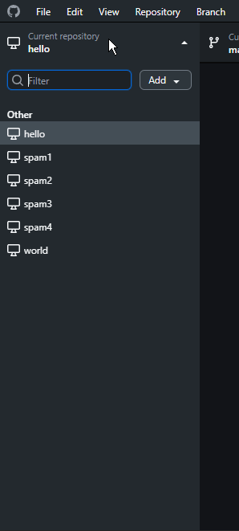

# gh-desktop-pin-repositories

Adds the option to pin repos at the top of the repository list in GitHub Desktop.

Context: https://github.com/desktop/desktop/issues/8183, https://github.com/desktop/desktop/issues/3410



## Features

| Patch | Description |
|-------|-------------|
| **pins** | Pin repositories to the top of the list |
| **remove-recent** | Remove the "Recent" repositories section |
| **disable-auto-updates** | Disable automatic updates, as updating would remove the patches |
| **fix-auth-handler** | Fix the authentication handler, as when building for prod without the GitHub Desktop app tokens (which are not public), the wrong OAuth callback is registered, making logging in more difficult |
| **separate-instance** | Run alongside official GitHub Desktop or run multiple patched versions simultaneously with multiple accounts |

## Quick Start

```bash
# Requires Node.js, Git, and Yarn installed
node apply.js
```

The script will:
1. Check prerequisites
2. Clone/setup the GitHub Desktop repository
3. Let you select which features to enable
4. Applies patches
5. Guide you through the build process

## Notes

- These patches are for GitHub Desktop 3.5.2 (`release-3.5.2`)
- The resulting installer and executable will be unsigned
- Uses the Developer OAuth app for authentication. For enterprise installations or auth issues, install official GitHub Desktop first, authenticate, then run the patched installer to "update". See [official docs](https://github.com/desktop/desktop/blob/development/docs/technical/oauth.md).
- If `separate-instance` is applied, a separate instance is installed, allowing multiple accounts on one machine